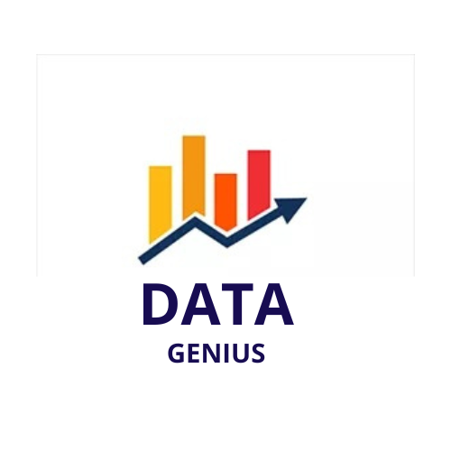
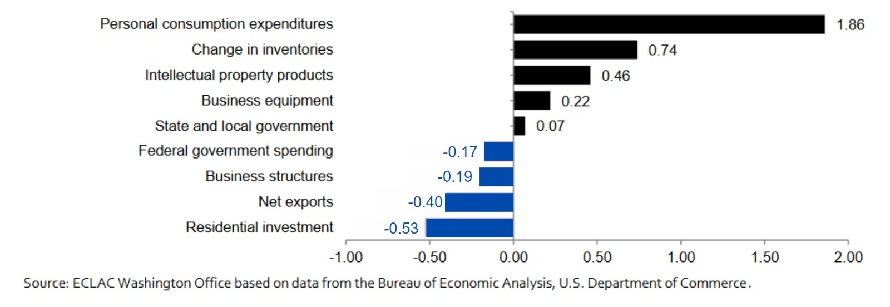
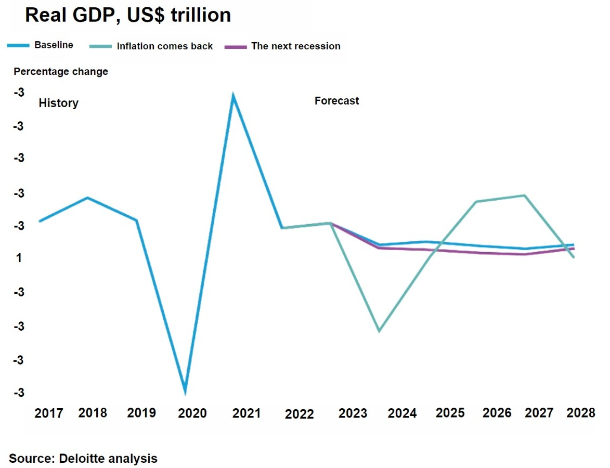
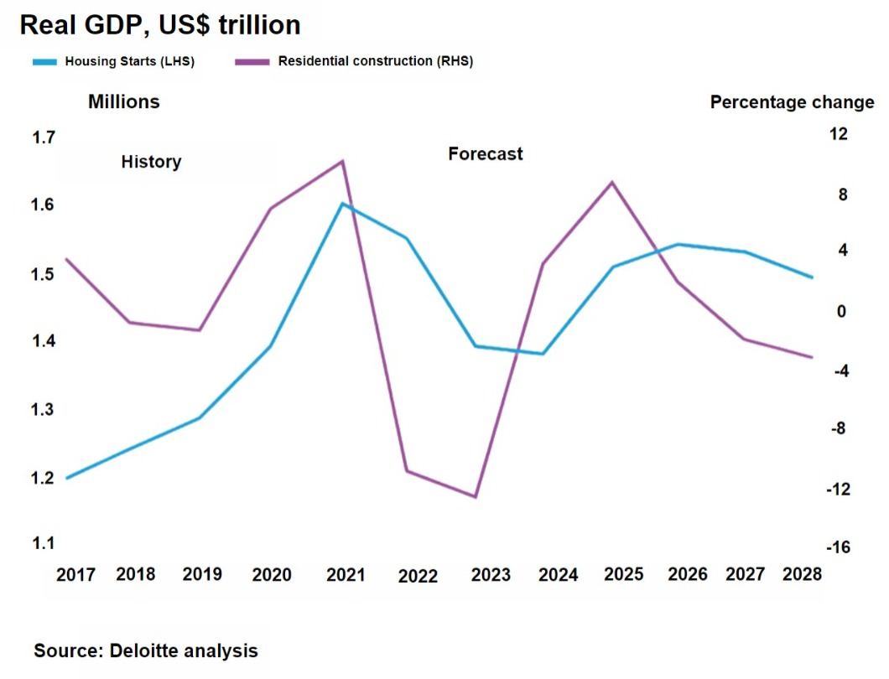
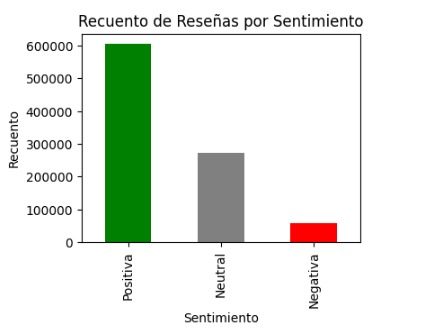
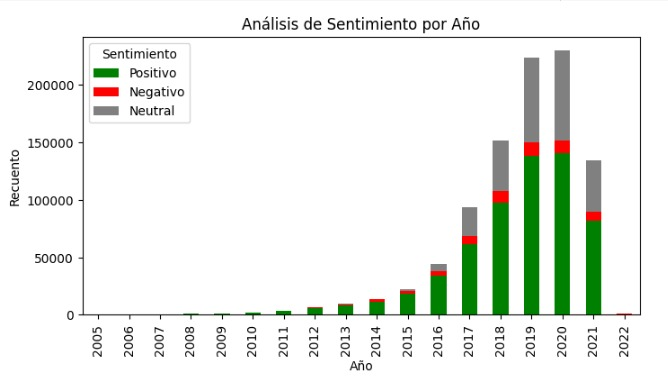
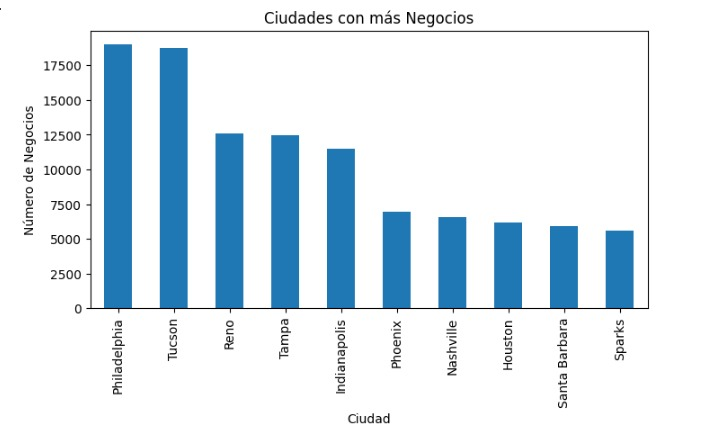
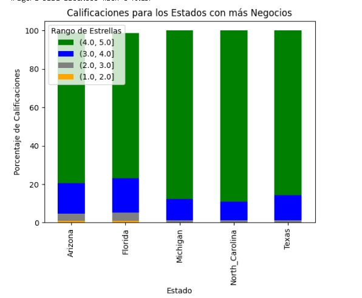
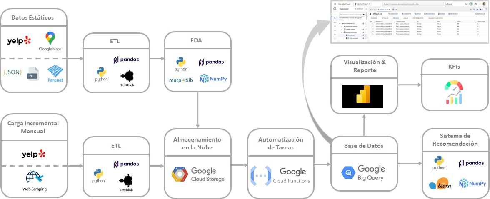
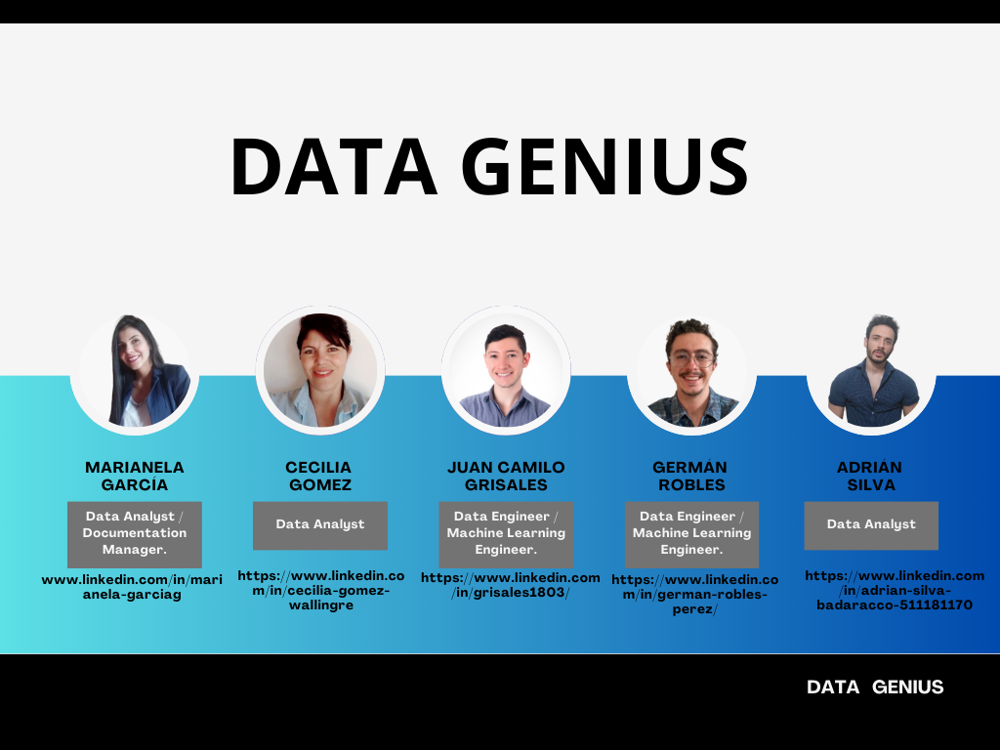

<h3 align="center">Proyecto Final</h3>

<h3 align="center">Data Science</h3>

  

<h3 align="center">YELP & GOOGLE MAPS - REVIEWS AND RECOMMENDATIONS</h3>

Somos una empresa especializada en análisis de datos, con un equipo altamente calificado que abarca desde Data Analysts hasta Machine Learning Engineers. Nuestra misión es desentrañar la valiosa información contenida en los comentarios de plataformas como Yelp y Google, para brindar a las empresas de construcción una visión profunda de su desempeño y las oportunidades de expansión que pueden aprovechar. Nuestro compromiso es proporcionar a nuestros clientes las herramientas necesarias para tomar decisiones fundamentadas y mejorar sus operaciones en un mercado altamente competitivo.

# Introducción

La arquitectura en Estados Unidos no solo refleja la evolución de la sociedad y los valores nacionales, sino que desempeña un papel fundamental en la economía del país. Las empresas constructoras en Estados Unidos son piezas clave en la creación y preservación del patrimonio arquitectónico de la nación, aportando de manera significativa al desarrollo y la modernización del país.

En Estados Unidos subrayan la importancia esencial de las empresas constructoras en la materialización de una amplia gama de proyectos, desde la restauración de edificios históricos hasta la construcción de rascacielos contemporáneos. Este papel fundamental de las contratistas no solo incide en la construcción, sino también en la configuración del carácter distintivo de Estados Unidos.

En este proyecto, exploraremos este emocionante viaje donde la opinión de los usuarios se convierte en un recurso inestimable para las empresas. Nos enfocaremos en la importancia de una gestión efectiva de reseñas en plataformas como Yelp y Google, especialmente en el contexto de una empresa como Construction Valdes, que enfrenta desafíos notables en su desempeño comercial. Analizaremos cómo estas reseñas pueden ser un componente clave en la resolución de los desafíos actuales de la empresa.

Finalmente, hemos optado por utilizar Google Cloud y BigQuery debido a su capacidad de escalabilidad flexible, lo que se adapta a las necesidades, independientemente del tamaño de los conjuntos de datos que se manejen. Esta flexibilidad para ajustar los recursos no solo mejora la eficiencia, sino que también permite un crecimiento sin complicaciones. Ambas plataformas ofrecen un equilibrio excepcional entre rendimiento, escalabilidad, seguridad y facilidad de uso, lo que las hace sumamente valiosas para una amplia variedad de aplicaciones empresariales y proyectos de análisis de datos.

# Contexto & Problemática

En la era digital actual, las opiniones de usuarios en plataformas como Yelp y Google son cruciales para las empresas. Estas reseñas influyen en las decisiones de compra y estrategias comerciales. Sin embargo, gestionar y analizar esta información valiosa puede ser un desafío, pero es esencial para comprender la percepción de los clientes y mejorar el rendimiento empresarial.

En el caso específico de Construction Valdes, la situación se complica aún más. La empresa ha experimentado una disminución significativa en las ventas, lo que sugiere que hay problemas más profundos en su desempeño comercial. Este declive en los resultados económicos es una preocupación importante y podría estar relacionado con la percepción negativa de los clientes, lo que hace que la gestión efectiva de las reseñas y la mejora de la imagen de la empresa sean aún más cruciales.

  
  
  

En resumen, la gestión de las reseñas de los usuarios en plataformas como Yelp y Google se ha vuelto vital para las empresas en la actualidad, y Construction Valdes enfrenta desafíos adicionales en su intento de revertir la disminución de ventas y contrataciones. El análisis de estas opiniones y su aplicación efectiva en la toma de decisiones comerciales se presenta como un componente clave en la resolución de la problemática actual de la empresa.

# Objetivos de Proyecto

### Objetivo General:

- Realizar una evaluación exhaustiva del sector de contratistas en todo Estados Unidos con el propósito de identificar oportunidades de mejora para el negocio Construction Valdes y analizar posibles estrategias de expansión a largo plazo.

### Objetivo Específicos: 

- Objetivo 1: 
     
    Llevar a cabo un análisis de mercado en beneficio de Construction Valdes, con el fin de identificar tendencias o patrones significativos.

- Objetivo 2: 

    Analizar el rendimiento actual de Construction Valdes y desarrollar estrategias destinadas a mejorar la interacción y desempeño con los clientes.

# KPIs

- **Satisfacción al Cliente:**
  - *Métrica:* Cantidad de reseñas positivas
  - *Meta:* Aumentar el 10% de reseñas positivas en el 2023.

- **Gestión de Construcciones Valdez a nivel estatal:**
  - *Métrica:* Cantidad anual de reseñas positivas de Construction Valdez / Cantidad anual de reseñas totales del mercado Estatal
  - *Meta:* Aumento de 10% anual en comparación con la actividad estatal.

- **Gestión de Construcciones Valdez a nivel nacional:**
  - *Métrica:* Cantidad anual de reseñas positivas de Construction Valdez / Cantidad anual de reseñas totales del mercado Nacional
  - *Meta:* Aumento del 10% en comparación con la actividad anual nacional

- **Cumplimiento de proyectos:**
  - *Métrica:* Número de reseñas con 5 estrellas de Construction Valdes / Número total de puntaje (campo estrellas)
  - *Meta:* Aumento del 5% en un año para Construction Valdes.

# Data

Los datos crudos se extrajeron de la carpeta de Google Drive proporcionada por Henry, concretamente de fuentes como Google Maps y Yelp. Estos datos se presentan en formatos que incluyen JSON, Parquet y Pickle.

En particular, se enfocó en la selección de negocios relacionados con el sector de la construcción (conocidos en Estados Unidos como contratistas). A partir de estos datos, se llevaron a cabo procesos de transformación (ETL) y exploración de datos (EDA) con el propósito de crear nuevos conjuntos de datos que estuvieran limpios, transformados y normalizados, listos para ser cargados en una base de datos.

## ETL (Extract, Transform, Load):

### Google Maps:

Los datos de Google Maps se encontraban en dos carpetas en formato JSON y fueron sometidos al siguiente proceso de tratamiento de datos:

- **medata-sitios:**
  - Se leyeron todos los archivos JSON contenidos en esta carpeta y se convirtieron en un dataframe. Este dataset contiene información detallada sobre lugares y negocios registrados en Google Maps.
  - Se creó una lista de categorías relacionadas con la línea de construcción (contratistas), empleada para filtrar los demás archivos.

- **reviews-estados:**
  - Los archivos JSON se leyeron por estados y se convirtieron en un dataframe. Este proceso se realizó para cada estado.
  - Los datasets creados contienen información sobre reseñas y acciones de usuarios en Google Maps por cada estado.
  - De acuerdo a la lista previamente creada con el archivo de medata-sitio (lista que contempla las categorías en el área de construcción), se aplicó una máscara al dataset de cada estado para contar solo con la línea seleccionada.
  - Se creó una columna en cada dataset con el estado correspondiente.
  - Los dataframes de cada estado se concatenaron para contar con la información completa de todos los estados.
  - El nuevo dataframe de todos los estados se fusionó con el dataframe reviews-sitios a través de la columna gmap_id.

[Enlace a notebook:](https://drive.google.com/drive/folders/1a7djToO058NtHjPVHixx8YmJpIUlK_VP)

### Yelp:

- **Checkin.json:**
  - Se leyó dicho archivo JSON y posteriormente se transformó en dataframe en formato .csv. Este contiene información de la registración del negocio en la plataforma Yelp. No fue empleado en el dataframe del proyecto.

- **tip.csv:**
  - Contiene información de comentarios extras que los usuarios hacen del negocio, no fue empleado en el dataframe del proyecto, ya que no proporciona información adicional necesaria para el análisis.

- **user-001.parquet:**
  - Este archivo se leyó a partir del archivo parquet y posteriormente se transformó en dataframe. De este dataframe se eliminaron las columnas irrelevantes para el análisis, ya que podían prestarse para confusión. Solo cuenta con las columnas: 'user_id', 'user_name' y 'average_stars', y finalmente se transformó en formato CSV.

- **review.json:**
  - El archivo de lectura se dividió en 14 archivos CSV con el propósito de optimizar el rendimiento computacional. Una vez convertidos al formato CSV, los archivos fueron fusionados. Luego, se eliminaron las columnas que no eran relevantes para el análisis, específicamente "useful," "funny" y "cool."

- **business.pkl:**
  - Se leyó el archivo en formato "pickle" de Python y se creó un DataFrame. Se eliminaron 14 columnas que contenían un 90% de datos faltantes para mejorar la calidad del DataFrame.
  - Se corrigió la columna estado, ya que contaba con el estado abreviado.
  - A partir del archivo review.csv, se creó una máscara de las categorías que contiene las categorías de contratista (línea seleccionada). Dicha máscara se aplicó al business.csv.

- Luego de aplicar el tratamiento mencionado, se procedió a concatenar los archivos de review y business en un nuevo archivo CSV, que fue renombrado como "review.csv."

- Se unen los DataFrames review y user, formando un nuevo dataframe llamado yelp.csv.

- Se acondicionaron las columnas de google_maps.csv con el objetivo de unificar criterios respecto al yelp.csv.

- Finalmente, se unen yelp.csv y google_maps.csv mediante la columna gmap_id, generando un nuevo dataframe llamado df_google_yelp en formato CSV. Esta base de datos estática será empleada para alimentar nuestro Google Cloud.

[Enlace a notebook:](https://drive.google.com/drive/folders/1a7djToO058NtHjPVHixx8YmJpIUlK_VP)

## EDA (Exploratory Data Analysis):

  
  

  
  
  

# Stack Tecnológico & Flujo de Trabajo

  

# Metodología SCRUM

## Equipo SCRUM:
- **Product Owner:** 
  - Es el interesado en el producto final. Fue el encargado de establecer las necesidades del producto.

- **Scrum Master:** Andrés Laurizi
  - Cuida el proyecto para que cumpla con los requerimientos del Product Owner. Tiene experiencia laboral previa en el ámbito del Data Analytics, así aconseja al equipo.

- **Desarrolladores:** Adrián Silva, Marianela García, Cecilia Gómez, Juan Camilo Grisales, Germán Robles

## Sprints:
- Total del proyecto: 3 semanas.
- Total de sprints: 3 sprints, 1 por semana.
- Cada semana se entrega un grupo de hitos para mostrar el avance del proyecto.
- Daily Meeting: Reunión diaria Desarrolladores + Scrum Master, 30 minutos.
- Revisión Sprint: Viernes, 30 minutos.

## Increment:
- Registro semanal de las actividades realizadas, incrementa gradualmente hasta completar el proyecto.

## Revisión Sprint:
- Product owner revisa los incrementos, logros alcanzados y faltantes.

## Burndown chart:
- Manejo de Diagrama de Gantt para organizar actividades y rastrear avance.

## Principios SCRUM:
- Transparencia
- Inspección
- Adaptación

## Flexibilidad SCRUM:
- Iterativo (sprints) e incremental
- Priorización dinámica
- Reuniones y eventos flexibles
- Auto-organización del equipo

# Diagrama de Gantt

  

# Conclusiones

Los productos que entregaremos a Construction Valdes son:

- Dashboard Interactivo con las siguientes visualizaciones:
  - Análisis de tendencias para identificar actividades de contratistas y construcción con más movimiento. 
  - Análisis de tendencias para identificar atributos que son importantes para los clientes. 
  - Análisis geográfico para identificar posibles zonas de inversión en todo Estados Unidos.  
  - Visualización de los Key Performance Indicators (KPIs)
- Sistema de recomendación para zonas futuras de inversión basados en actividades de contratistas y construcción (por ejemplo, Exteriores, Remodelación de Interiores, etc)
- Plan de acción para aumentar las ventas en base al análisis del mercado estadounidense.

# Miembros del equipo

- *Data Analyst / Documentation Manager:* Esta persona tendrá un doble rol. Por un lado, se encargará de analizar los datos, lo que implica recopilar, limpiar y analizar la información para extraer conocimientos y generar informes. Por otro lado, también será el encargado de gestionar la documentación relacionada con el proyecto, como la creación y organización de documentos, informes y registros.

- *Data Analyst:* Este rol estará centrado exclusivamente en el análisis de datos. La persona asignada será responsable de recopilar, limpiar, analizar y presentar los datos de manera efectiva para tomar decisiones informadas.

- *Data Engineer / Machine Learning Engineer:* Esta persona tendrá un rol combinado. Por un lado, se encargará de la ingeniería de datos, lo que implica la preparación y organización de los datos para su análisis. Por otro lado, también estará involucrada en el desarrollo de soluciones de aprendizaje automático si es necesario en el proyecto. Esto incluye la construcción de modelos de machine learning y su implementación.

  

